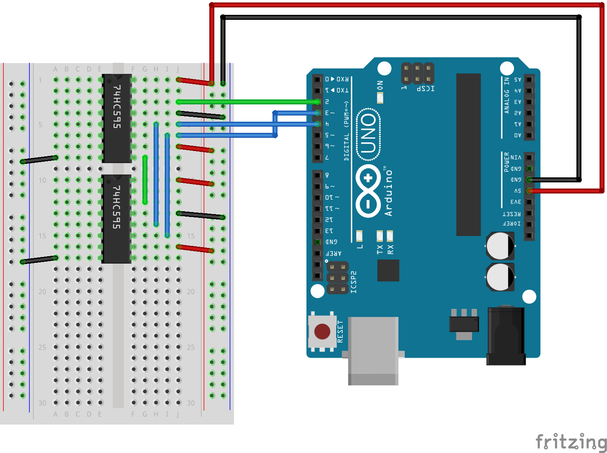

# Library for 74HC595 shift register IC

'sreg' is a Arduino compatible library that provides a useful set of higher level routines for controlling 74HC595
shift register(s) IC (Integrated Circuit). These ICs are widely used as IO expanders for
digital signal outpus.

## Dependencies
The library is designed to work within the Arduino framework. So this is the only dependency.
Many developement boards out there are Arduino compatible and the library will work with them too.

## Features
- Write 0 or 1 to specific pin on the IC
- Write 0s and 1s to multiple pins at once (e.g. 0b11001100)
- Invert bit at specific pin
- Test the value of a specific pin
- Test all pin values
- Daisy-chain multiple shift registers

## Mental model
Technically, you don't write to shift register, nor you read from. You shift values on clock
cycles and then latch them to the outputs. However it is more convenient to think of the shift
register outputs as if they were part of your controller (e.g Arduino, Teensy).
This means you can refer to them with pin numbers and write values.

## Usage

Below you can find several use cases with examples.

### Initialization

This function is required. It initializes the shift register(s) inputs and tells the library
how many ICs are chained together:

```c
/*
* Initializes the shift register IC
* @ds - data input
* @shcp - clock
* @stcp - latch
* @init_value - number describing the initial state of the reg(s)
* @sreg_count - the number of the shift register ICs chained together
*/
void sreg_init(uint8_t ds, uint8_t shcp, uint8_t stcp, int init_value, uint8_t sreg_count)
```

Example - single shift register initialization:

```c
#include <Arduino.h>
#include <sreg.h>

init() {
        /* ds, shcp, stcp, init_value, sreg_count */
        sreg_init(2, 3, 4, 0b11111100, 1);
}

```

This will connect the ds, shcp and stcp inputs of 74HC595 to Arduino UNO's 2nd, 3rd and 4th output pins as shown on the schematics below:


Fig. 1

Example - 2 daisy-chained shift registers initialization:

```c
sreg_init(2, 3, 4, 0b1111110011111100, 2);
```


Fig. 2

### Write bit to a specific pin

The function that write single bit to a pin has the following signature:

```c
/*
* Overwrites specific bit in the register
* @pin - the physical pin where the bit_value should be written to
* @bit_value - the value of the pin, 0 or 1. If you pass an integer
* other than 0, it's autmatically converted to 1.
*/
void sreg_write_bit(int pin, int bit_value)
```

Example:

```c
sreg_latch_low(); // start reading from Arduino
sreg_write_bit(0, 1); // writes 1 to the first output
sreg_write_bit(1, HIGH); // you can use HIGH or LOW constans if you like
sreg_latch_high(); // stop reading and send (latch) the values to the pins
```

**NOTE:** 74HC595 shifts in values on the rising edge of the clock (SHCP) and send the values
to the pins on the rising edge of the latch (STCP). In other words, before writing to the shift
register call `sreg_latch_low();` and after you are done, call `sreg_latch_high();`. Very often
this can be done like so:

```c
loop() {
        sreg_latch_low();
        // your logic goes here
        sreg_latch_high();
}
```

If you wonder why this doesn't happen automatically inside `sreg_write_bit` function, it's because
you normally would like to shift in all the values you want and then latch them at once, and not latching
them on every clock cycle. This approach avoids the undesired overhead.


### Invert bit

This function is similar to `sreg_write_bit` but it takes one parameter (the output pin of the
74HC595) and toggles its current value. If it was 0 it becomes 1 and vice versa:

```c
/*
* Inverts (negates) specific bit in the register
* @pin - the physical pin where the bit_value should be written to
*/
void sreg_invert_bit(int pin)
```

Example:

```c
loop() {
        sreg_latch_low();
        sreg_invert_bit(3); // will toggle the value of the 4th pin of the shift register IC
        sreg_latch_high();
}
```

### Write multiple bits at once

If you want to send values to multiple outputs at once use this function:

```c
/*
* Writes all bits at once
* @bits - a number, each digit of which (in binary representation) will be sent to
* the corresponding shift register pin, e.g. 0b00000011 will set pin0 to 1,
* pin1 to 1 and all the rest to 0
*/
void sreg_write_bits(int bits)
```

**NOTE:** In this case you don't need to call `sreg_latch_low();` and `sreg_latch_high();`
respectively, because you are overriding all values anyways and thus these routines are
called automatically by the library. Also note the 's' at the end of the function name.
This function also works for daisy-chained shift register ICs.

Example:

```c
loop() {
        sreg_write_bits(0b11001100); // write 1s to pins 3, 4, 7 and 8
        delay(500);
        sreg_write_bits(0); // annulate all outputs
        delay(500);
        sreg_write_bits(((1 << 8) - 1)); // write eight ones, i.e. write 1 to all outputs
        delay(500);
}
```

### Utility functions

There are two more functions that can be useful if you want to test the current state of the
shift register(s), i.e. whether sertain output is LOW or HIGH.

```c
/*
* Tests shift register pin value
* @pin - the pin which we want to read the value
* @returns - 0 or 1
*/
int sreg_test_bit(int pin)

/*
* Tests all bits stored in shcp register
* @returns - integer which is the state of the shcp register
*/
int sreg_test_all_bits()
```

Example:

```c
init() {
        // ds, shcp, stcp, init_value, sreg_count
        sreg_init(2, 3, 4, 0b11111100, 1);

        sreg_test_bit(0); // returns 0
        sreg_test_bit(2); // returns 1
        sreg_test_bit(3); // returns 1
        sreg_test_all_bits(); // returns 252 in decimal which is 11111100 in binary
}
```

### Daisy-chain multiple shift register ICs

You can chain multiple ICs by connecting the serial data output (usually denotated with Q7S)
at pin 9 of the first register to the DS pin of the second register (the green wire on *Fig. 2*). The DHCP and SHCP pins
of the first shift register are connected to the DHCP and SHCP pins of the second shift
register respectively (the 2 blue wires on *Fig. 2*.

Example - initialize with two shift register:

```c
#include <Arduino.h>
#include <sreg.h>

#define NUM_SHIFT_REGISTERS 2

init() {
        /* ds, shcp, stcp, init_value, sreg_count */
        sreg_init(2, 3, 4, 0b1111110011111100, NUM_SHIFT_REGISTERS);
}

loop() {
        sreg_write_bits(0b1101110011001100);
        delay(500);
        sreg_write_bits(0);
        delay(500);
}
```